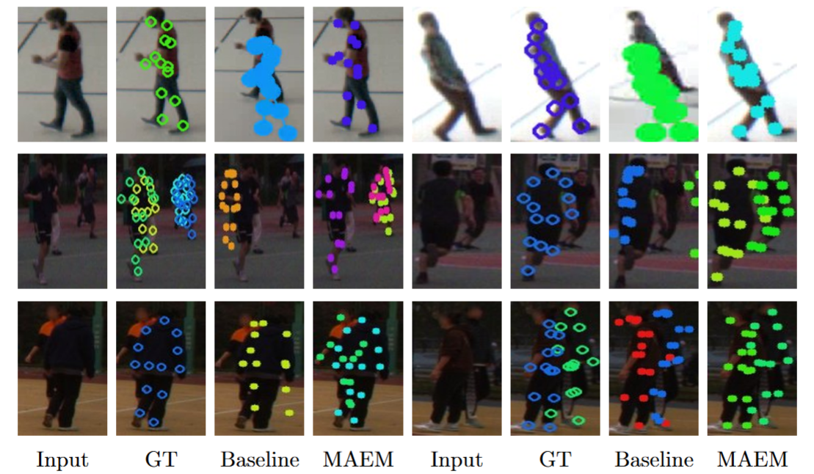

# MAEM: Mesh-Aware Epipolar Matching for Multi-View Multi-Person 3D Pose Estimation in Basketball

## Overview
MAEM (Mesh-Aware Epipolar Matching) is a retraining-free multi-view multi-person 3D pose estimation framework explicitly designed for team basketball scenarios. MAEM achieves cross-view association purely through geometric constraints, requiring zero target-domain network retraining. MAEM was evaluated on two public multi-view datasets: 
- [SportCenter Multi-View Human Pose Estimation Dataset](https://www.epfl.ch/labs/cvlab/data/sportcenter-dataset/)
- [Human-M3 Dataset](https://github.com/soullessrobot/Human-M3-Dataset)




## Usage Pipeline
## Stage 1: Single &mdash; View 3D Mesh Recovery.

We employ the [SAM 3D Body model](https://github.com/facebookresearch/sam-3d-body) as the single-view perception frontend to extract a rich suite of 2D and 3D spatial attributes, including 3D human mesh vertex coordinates, their corresponding 2D projections, as well as 2D/3D joint keypoints and bounding boxes.

Please clone the official repository and set up environment configurations following the SAM 3D Body [official guidelines](https://github.com/facebookresearch/sam-3d-body/blob/main/INSTALL.md).

    conda activate sam_3d_body
    cd sam-3d-body

    python sam_prediction.py \
    --checkpoints_dir     /path/to/checkpoints \
    --img_root_folder     /path/to/images \
    --output_dir          /path/to/output

Run once per dataset (SportCenter, Basketball1/split1, Basketball1/split2, Basketball2), pointing `--img_root_folder`/`--output_dir` at that dataset's `images/` folder and a dataset-specific output directory.

```text
Input:
├── images/
│   ├── camera_0/   # *.jpg / *.png
│   ├── camera_1/
│   └── ...

Output:
└── output/
    ├── camera_0/
    │   ├── <frame>.jpg        # rendered overlay image
    │   └── npz/
    │       └── <frame>.npz    # pred_keypoints_3d, pred_keypoints_2d,
    │                            pred_keypoints_2d_verts, bbox, bbox_score, pred_cam_t
    └── ...

```
**Note:** `pred_keypoints_2d_verts` (2D projections of all 18,439 mesh vertices) is added by modifying SAM-3D-Body source and is required by the epipolar matching stage.


## Stage 2 &mdash; Cross-view Matching and Clustering
cd ..

**SportCenter dataset** (6 fisheye cameras, `ace_{i}` view naming):
```
python epipolar_matching_clustering.py \
    --output_dir           /path/to/stage1_output \
    --camera_param_dir     /path/to/camera_params \
    --scene_dir             /path/to/images \
    --intermediate_output  /path/to/output/intermediate_matched_clusters.pkl \
    --view_name_pattern    "ace_{i}" \
    --num_views             6 \
    --camera_param_pattern "fisheye_param_{i:02d}.json" \
    --matching_mode        epi_gate \
    --bbox_score_threshold 0.9 \
    --epi_threshold         8.0 \
    --repr_threshold        10.0 \
    --min_views_cluster     4 \
    --start_frame           <start_frame> \
    --num_frames            <num_frames> \
    --frame_step            <frame_step, 1 if contiguous>
```

**Human-M3 Basketball1** (4 standard cameras). Basketball1's test set is two independent 200-frame clips (`split1`, `split2`) recorded from the same fixed 4-camera rig — both happen to be frame-numbered 1800–1999, so run each split as its own Stage 2/3 pass and combine them in Stage 3 (see [Combining Basketball1 + Basketball2](#combining-basketball1--basketball2-for-a-combined-table)):
```
for SPLIT in split1 split2; do
python epipolar_matching_clustering.py \
    --output_dir           /path/to/humanm3/test/basketball1/$SPLIT/stage1_output \
    --camera_param_dir     /path/to/humanm3/test/basketball1/$SPLIT/camera_calibration \
    --scene_dir             /path/to/humanm3/test/basketball1/$SPLIT/images \
    --intermediate_output  /path/to/output/basketball1_$SPLIT/intermediate_matched_clusters.pkl \
    --view_name_pattern    "camera_{i}" \
    --num_views             4 \
    --camera_param_pattern "fisheye_param_{i:02d}.json" \
    --matching_mode        epi_gate \
    --bbox_score_threshold 0.7 \
    --epi_threshold         8.0 \
    --repr_threshold        30.0 \
    --min_views_cluster     2 \
    --start_frame            1800 \
    --num_frames             200 \
    --keypoint_convention   humanm3_15
done
```

**Human-M3 Basketball2** (3 standard cameras, 500-frame test clip starting at frame 4500):
```
python epipolar_matching_clustering.py \
    --output_dir           /path/to/humanm3/test/basketball2/stage1_output \
    --camera_param_dir     /path/to/humanm3/test/basketball2/camera_calibration \
    --scene_dir             /path/to/humanm3/test/basketball2/images \
    --intermediate_output  /path/to/output/basketball2/intermediate_matched_clusters.pkl \
    --view_name_pattern    "camera_{i}" \
    --num_views             3 \
    --camera_param_pattern "fisheye_param_{i:02d}.json" \
    --matching_mode        epi_gate \
    --bbox_score_threshold 0.7 \
    --epi_threshold         8.0 \
    --repr_threshold        30.0 \
    --min_views_cluster     2 \
    --start_frame            4500 \
    --num_frames             500 \
    --keypoint_convention   humanm3_15
```
**Key parameters:**

| Parameter | Description | Default |
|---|---|---|
| `--view_name_pattern` | View folder name template(two datasets use distinct file names and folder names), e.g. `"ace_{i}"` or `"camera_{i}"` | `ace_{i}` |
| `--num_views` | Number of camera views | `6` |
| `--camera_param_pattern` | Camera JSON filename template, e.g. `"fisheye_param_{i:02d}.json"` | `fisheye_param_{i:02d}.json` |
| `--matching_mode` | `epi_gate` (reprojection + epipolar matching) | `epi_gate` |
| `--bbox_score_threshold` | Detection confidence threshold | `0.9` |
| `--epi_threshold` | Epipolar distance threshold (pixels) | `8.0` |
| `--repr_threshold` | BBox center reprojection error threshold | `10.0` |
| `--min_views_cluster` | Minimum views required to form a valid person cluster | `4` |
| `--num_frames` | Total frames to process, **required** — covers every frame including zero-detection ones so Stage 3's GT denominator is never silently undercounted (see [Frame completeness](#frame-completeness)) | — |
| `--start_frame` | First frame number | `0` |
| `--frame_step` | Stride between frame numbers — Human-M3 is contiguous (`1`), SportCenter clips seen during development are sampled every 3rd frame | `1` |
| `--keypoint_convention` | `sportcenter_13` or `humanm3_15` (adds pelvis/neck to match Human-M3's own evaluation protocol — see [Keypoint conventions](#keypoint-conventions)) | `sportcenter_13` |
| `--vertex_sample_rate` | Use every Nth mesh vertex for the epipolar cost, 1=all (see [Table 7](#reproducing-table-7--vertex-subsampling)) | `1` |
| `--visualize_matches` | Save per-frame match visualization images | `False` |

**Output:**

| File | Description |
|---|---|
| `intermediate_matched_clusters.pkl` | Per-frame person clusters, each with 2D keypoints per view, used as input to Stage 3 |
| `matching_results.json` | Human-readable summary: per-frame match info, scores, cluster sizes |


### Keypoint conventions

`pred_keypoints_3d`/`pred_keypoints_2d` are reduced from SAM-3D-Body's 70-keypoint MHR output (`sam_3d_body/metadata/mhr70.py`) to a fixed subset. Two conventions are supported, selected per-dataset:

| `--keypoint_convention` | Joints | Used for |
|---|---|---|
| `sportcenter_13` (default) | head, L/R shoulder, L/R elbow, L/R wrist, L/R hip, L/R knee, L/R ankle | SportCenter, and legacy Human-M3 results computed against a 13-point GT |
| `humanm3_15` | the above **plus pelvis and neck**, in Human-M3's own joint order | matching Human-M3's official evaluation protocol (`lib/dataset/human_m3.py`'s `valid_joints_def`), for numbers meant to be compared against MMVP |


   
## Stage 3 — Triangulation and Evaluation

Triangulate matched clusters into 3D poses using RANSAC, then compute MPJPE, PA-MPJPE, Recall and AP against ground truth, following Human-M3's own protocol (`lib/dataset/human_m3.py`): each prediction independently finds its own nearest GT (no Hungarian assignment), duplicates are resolved by confidence ranking, and AP is computed at the same six thresholds Human-M3 uses (25/50/75/100/125/150mm). The confidence signal is this pipeline's own mean bbox-detection score across the views that contributed to each triangulated person — not Human-M3's CuboidProposalNet person-confidence — so the *protocol* matches but the resulting numbers are not bit-comparable to Human-M3/MMVP-paper values.

This step utilizes [xrMoCap](https://github.com/openxrlab/xrmocap) as an external dependency. Please ensure you have cloned their official repository and configured the necessary environment following [official instruction](https://github.com/openxrlab/xrmocap/blob/main/docs/en/installation.md).

```
conda deactivate sam_3d_body
conda activate xrmocap

python triangulation_evaluation.py \
    --intermediate_input  /path/to/intermediate_matched_clusters.pkl \
    --output_dir          /path/to/output \
    --gt_file             /path/to/keypoints3d_GT.npz \
    --reproj_threshold    20.0
```

`--intermediate_input` and `--gt_file` each accept multiple, space-separated paths (same count, same order) to combine several datasets into one evaluation — see [Combining Basketball1 + Basketball2](#combining-basketball1--basketball2-for-a-combined-table). Even a single dataset's outputs land one level down, at `<output_dir>/dataset0/` (or `<output_dir>/<name>/` if `--dataset_name` is given), alongside a top-level `evaluation_results_combined.json`.


### Combining Basketball1 + Basketball2 for a combined table

Pass every split's `intermediate_matched_clusters.pkl`/`keypoints3d_GT.npz` pair in one call. Metrics are reported **per dataset** (each split/scene evaluated on its own) and **combined** — the combined numbers are computed from the union of all datasets' predictions in one Human-M3-style `eval_list` (matching how Human-M3 itself evaluates multiple scenes as one combined set), not by averaging the per-dataset numbers after the fact:

```
python triangulation_evaluation.py \
    --intermediate_input  out/basketball1_split1/intermediate_matched_clusters.pkl \
                          out/basketball1_split2/intermediate_matched_clusters.pkl \
                          out/basketball2/intermediate_matched_clusters.pkl \
    --gt_file             /path/to/basketball1/split1/keypoints3d_GT.npz \
                          /path/to/basketball1/split2/keypoints3d_GT.npz \
                          /path/to/basketball2/keypoints3d_GT.npz \
    --dataset_name        basketball1_split1 basketball1_split2 basketball2 \
    --output_dir           out/combined \
    --reproj_threshold     20.0
```
To get a Basketball1-only row (split1+split2 combined) and a Basketball2-only row instead, run the same command twice — once with just the two `basketball1_*` pairs, once with just `basketball2` — or read the per-dataset breakdown out of the combined run's `evaluation_results_combined.json` (see below) and combine whichever subset your table needs by re-running with just those datasets.

**Output (single-dataset run):**

| File | Description |
|---|---|
| `<output_dir>/<dataset_name>/predicted_3d_poses_xrmocap.npz` | Triangulated 3D poses, padded `(n_frames, n_persons, n_kpts, 3)` |
| `<output_dir>/<dataset_name>/predicted_3d_poses_gt_format.npz` | Same triangulated poses, reshaped to match the GT array for direct comparison |
| `<output_dir>/<dataset_name>/evaluation_results_xrmocap.json` | This dataset's MPJPE / PA-MPJPE / Recall / AP |
| `<output_dir>/evaluation_results_combined.json` | `{datasets, per_dataset, per_dataset_triangulation_time_sec, combined}` — always written, even for a single dataset |
| `part2_triangulation_<timestamp>.log` | Evaluation log, per-frame nearest-GT matches, and per-dataset triangulation runtime |

**Ground truth file format (`keypoints3d_GT.npz`):**

| Key | Shape | Description |
|---|---|---|
| `pose` | `(n_frames, n_persons, n_keypoints, 4)` | World-space 3D coordinates `[x, y, z, 1.0]`, unit: metres |
| `mask` | `(n_frames, n_persons, n_keypoints)` | Validity mask — `1` valid, `0` occluded / missing |
| `convention` | string scalar | Keypoint format name |

Persons with `mask.sum() == 0` are placeholder slots and are skipped during evaluation. Only joints where `mask == 1` contribute to MPJPE.
For more file format information, please refer to [xrmocap official instructions](https://github.com/openxrlab/xrmocap/blob/main/docs/en/data_structure/keypoints.md)


---

## Train/Test Split

MAEM is retraining-free — there is no training step or learned weights anywhere in this pipeline, so `train/` is never used to fit a model. It's only used once, manually, to pick the pipeline's thresholds (`--bbox_score_threshold`, `--epi_threshold`, `--repr_threshold`, `--min_views_cluster`, `--reproj_threshold`): those values are confirmed by running on `train/`, then **fixed** and applied unchanged to `test/` for every number reported in the paper. Stage 1/2/3 themselves only ever run against `test/`:

---

##  Threshold Sensitivity

`run_threshold_sensitivity_experiment.sh` sweeps each of the 5 pipeline thresholds one at a time around a fixed baseline (detection confidence, bbox reprojection, mesh epipolar distance, Kmin, RANSAC inlier threshold), running Stage 2 + Stage 3 for every value. Edit the path variables at the top of the script for your data layout, then:
```
bash run_threshold_sensitivity_experiment.sh
```
Each run's `evaluation_results_xrmocap.json` (recall/MPJPE/AP) lands under `output/sensitivity_experiment/<parameter>/<value>/`; plot whichever metric Figure 4 uses against the swept value. The script skips any run whose output already exists, so it can be interrupted and resumed.

## Vertex Subsampling

`run_vertex_downsample_experiment.sh` sweeps `--vertex_sample_rate` (1, 2, 4, 8, 16, 32, 64— i.e. 1×, 1/2×, 1/4×, ... of the ~18,439 mesh vertices used for the Stage-2 epipolar gate) holding everything else at baseline:
```
bash run_vertex_downsample_experiment.sh
```
Results land under `output/vertex_downsample_experiment/rate_<N>/`; each `driver_stage2.log` also has the wall-clock Stage 2 runtime (from the shell `time` builtin) for the speed side of the accuracy/speed trade-off table.

## Runtime Measurement

No separate profiling tool needed — all three stages log their own timing directly, each averaged over the full input sequence (not just frames with a valid prediction):
- **Stage 1**: `Mesh recovery timing: <n> images, total=<s>s, avg=<ms>/image` in the log.
- **Stage 2**: three separate lines — `Bbox reprojection filtering timing`, `Dense epipolar matching timing`, `Clustering timing` (each `<n> frames, total=<ms>, avg=<ms>/frame`), plus a `Gate timing (<mode>, repr+epi combined)` line summing the first two.
- **Stage 3**: `Triangulation time: <s>s total, <ms>/frame` per dataset, and the same number under `per_dataset_triangulation_time_sec` in `evaluation_results_combined.json`.

For full wall-clock time (including model I/O), just `time` the whole command — the two sweep scripts above already do this per run via the shell `time` builtin.

---

## Camera Parameter Format

Camera JSON files are expected to contain the following fields:

```json
{
    "intrinsic": [[fx, 0, cx], [0, fy, cy], [0, 0, 1]],
    "extrinsic_r": [[...], [...], [...]],
    "extrinsic_t": [tx, ty, tz],
    "k1": 0.0, "k2": 0.0, "k3": 0.0,
    "p1": 0.0, "p2": 0.0,
    "height": height,
    "width": width,
}
```

Alternatively, a 4×4 homogeneous `extrinsic` matrix can be used in place of `extrinsic_r` + `extrinsic_t`:

```json
{
    "intrinsic": [[fx, 0, cx], [0, fy, cy], [0, 0, 1]],
    "extrinsic": [[r00, r01, r02, tx], [r10, r11, r12, ty],
                  [r20, r21, r22, tz], [0,   0,   0,   1]],
    "k1": 0.0, "k2": 0.0,
    "height": height,
    "width": width,
}
```

All distortion coefficients are optional and default to `0.0` if absent.


## Citation

If you find this work useful, please cite:

```bibtex

```
